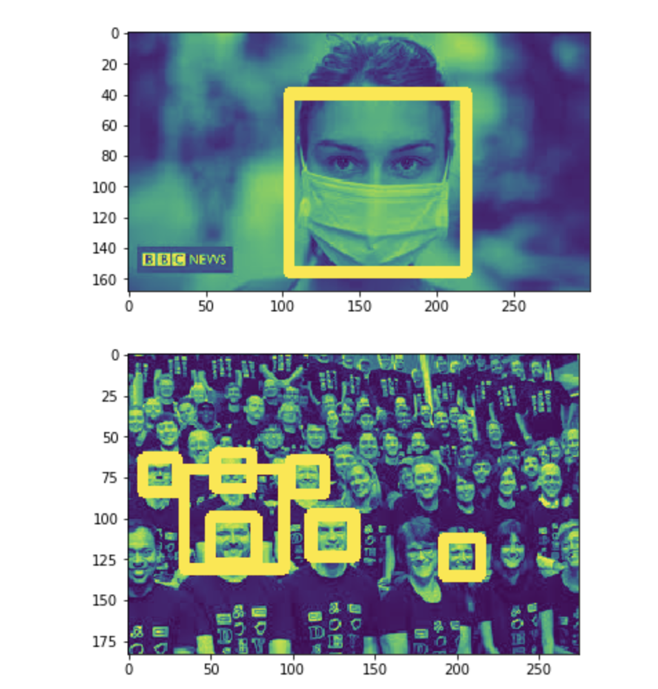
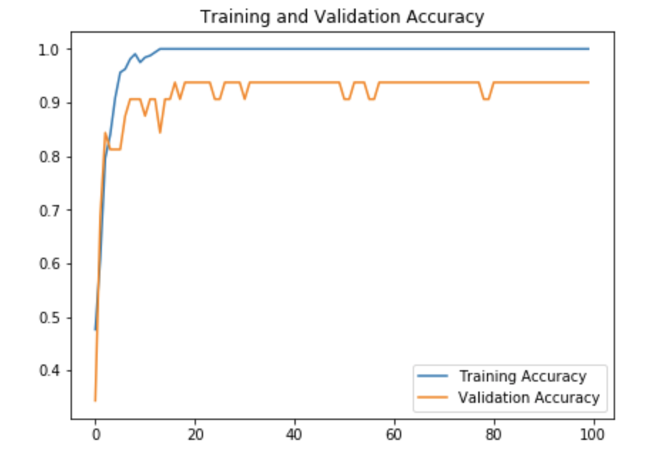

# CoronaMaskOn
> Mask control with computer vision


WHO(World Health Organization)
https://www.who.int/health-topics/coronavirus#tab=tab_1

Coronavirus disease (COVID-19) is an infectious disease caused by a newly discovered coronavirus.
Most people infected with the COVID-19 virus will experience mild to moderate respiratory illness and recover without requiring special treatment.  Older people, and those with underlying medical problems like cardiovascular disease, diabetes, chronic respiratory disease, and cancer are more likely to develop serious illness.

# Demo Video
You can reach demo video [here](https://www.loom.com/share/ffe622e9e0534febb4792c29c04ed288).


# Dataset 
Dataset includes masked human faces and unmasked human faces.


- The pictures were downloaded from google with the [chrome extension](https://chrome.google.com/webstore/detail/download-all-images/ifipmflagepipjokmbdecpmjbibjnakm).
- Faces in the pictures were detected and extracted with the Opencv library. After that converted to grayscale format. 



# Training
Training details are in this notebook: [training.ipynb](training.ipynb).



# Try It Yourself

I share the trained model with you. You can find it [here](https://drive.google.com/open?id=1nRxPkhaljcz53KJCN51p2DHrobVLQAnB).

To try application with webcam, run below code.

``` 

python camera_mask_control.py

```

> NOTE: I am still trying to expand the dataset even more. I will also continue to develop the model using with extended dataset and pre-trained model. When I complete the dataset, It will be public.

